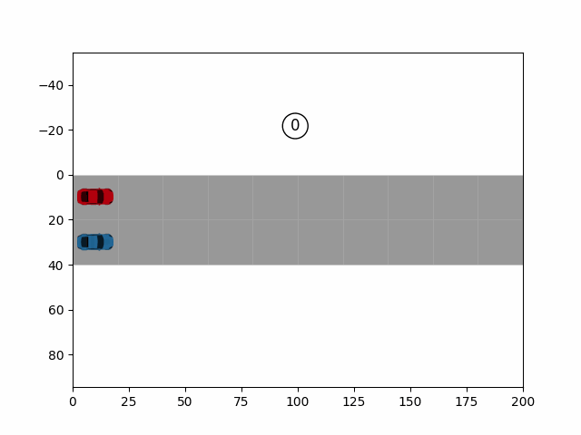

# Compositional Scenario Testing
## Authors and Contributors
Apurva Badithela, Josefine B. Graebener  

## Description
Scenario generation using Monte Carlo Tree Search.

## Requirements
Python 3.x 
Packages: see **requirements.txt** - TO DO  

## Instructions
TO DO  

## Example

