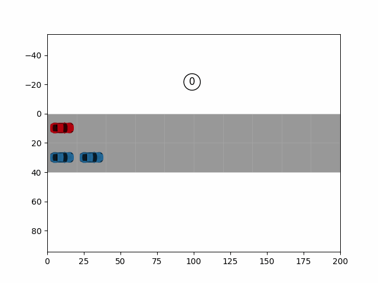

# Compositional Scenario Testing
## Authors and Contributors
Apurva Badithela, Josefine B. Graebener  

## Description
Framework to merge unit tests for autonomous vehicles using a winning set filter synthesized from the combined test specification and Monte Carlo Tree Search.

## Requirements
Python 3.x 
Packages: see **requirements.txt**  

## Instructions
1. Install the required packages by running 'pip install -r requirements.txt'  
2. Run sim_merge.py for a demonstration of the highway merge  

## Example
### Highway Merge

